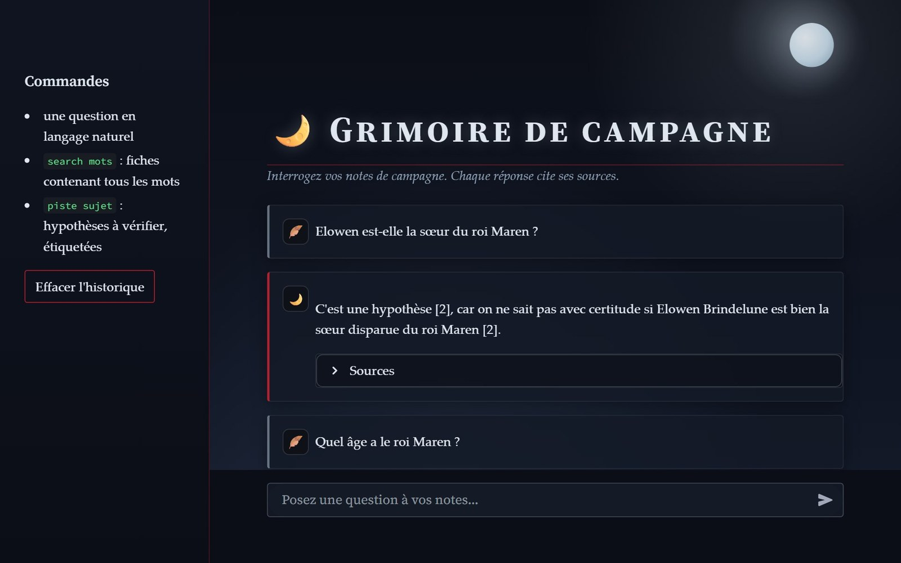
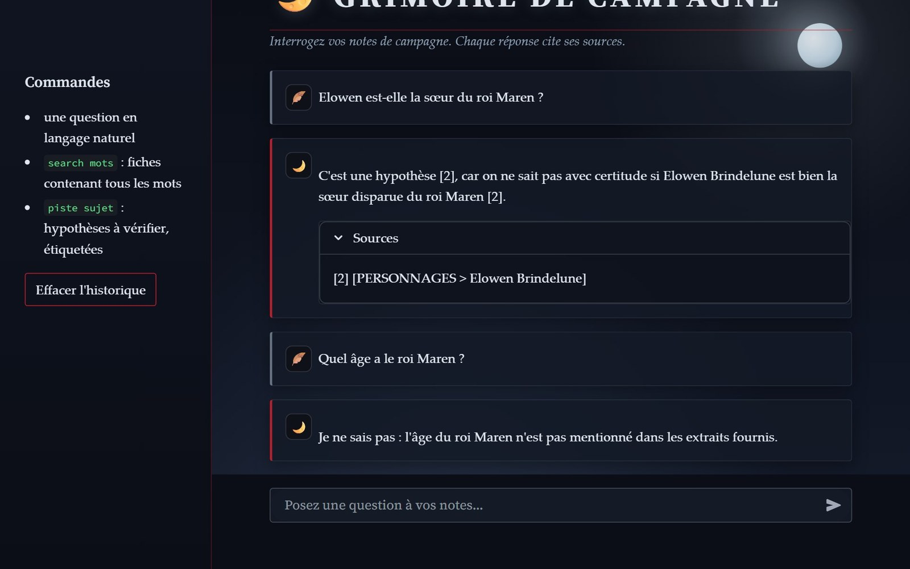

# Chatbot IA - RAG local (Ollama)

Un chatbot Python en français qui répond à partir d'une **base de connaissances** (un univers de jeu de rôle inventé), avec sources citées. Il utilise un LLM local (**Qwen2.5 7B via Ollama**) : les extraits pertinents sont injectés dans le prompt (RAG). Une expérience de fine-tuning LoRA (GPT-2) est conservée dans `legacy/`.

> Le projet évolue vers un chatbot RAG 100 % local : voir [Futur du projet](#futur-du-projet--pivot-vers-un-chatbot-rag-100--local).

* Le fine-tuning n’a pas pu être conclu (dataset trop limité, modèle inadapté au français).
* Les scripts de `legacy/` redirigent le cache HuggingFace vers `D:\huggingface_cache` (manque de place sur C:). Supprimez la ligne `os.environ["HF_HOME"]` de `legacy/finetune_lora.py` si vous n'en avez pas besoin.

## Aperçu

Captures de l'interface web (Streamlit) sur l'univers fictif d'exemple `data/sample_lore/` : une réponse prudente avec sa source quand les notes ne sont pas certaines, et un « je ne sais pas » quand l'information n'existe pas.

| Question sur une hypothèse | Source citée, puis abstention |
| --- | --- |
|  |  |

## En bref

- **RAG 100 % local** : Qwen2.5 7B via Ollama, embeddings `multilingual-e5-small` dans ChromaDB, recherche hybride mots-clés et sens, liens entre fiches.
- **Mesuré** : récupération (hit@6 = 96 % en hybride sur 25 questions) et réponses (53 questions, notation déterministe) ; détails et limites dans [Évaluation des réponses](#évaluation-des-réponses).
- **Honnête sur ses limites** : jeu de test petit, écarts entre configurations modestes, fine-tuning LoRA abandonné (conservé dans `legacy/`).

---

## Fonctionnalités principales

- Chat en temps réel dans le terminal (`console_chat.py`) ou dans une interface web Streamlit (`interface.py`) : thème sombre « nuit d'orage » (brume, pluie, vignette, éclair unique à l'ouverture ; CSS local, aucune ressource téléchargée ; animations coupées si le système demande de réduire les mouvements), sources repliées sous chaque réponse, lecteur de musique d'ambiance facultatif (`assets/ambiance.mp3`, jamais versionné)
- Historique sauvegardé automatiquement (`chat_history.json`, ignoré par git) et repris au lancement
- Contexte des derniers échanges transmis au modèle
- Réponses fondées sur les extraits retrouvés, avec sources affichées (« Je ne sais pas » si rien de pertinent)
- `search <mots>` : recherche dans la base de connaissances (tous les mots doivent apparaître, accents et casse ignorés), puis dans l’historique
- Commandes du terminal : `search`, `piste`, `reset`, `quit`
- Tests unitaires de la recherche et de la construction de la base (`tests/`)

---

## Organisation des fichiers

- `main.py` : classe `Chatbot` (Ollama, historique, récupération des extraits, génération).
- `console_chat.py` / `interface.py` : interfaces terminal et web.
- `knowledge.py` : chargement, recherche `search` et récupération par mots-clés (noms, alias).
- `vector_store.py` / `retrieval.py` : recherche par sens (embeddings `multilingual-e5-small` dans ChromaDB, index dans `data/vectordb/`, reconstruit automatiquement) et fusion hybride avec les mots-clés.
- `graph.py` : liens entre fiches (mentions explicites d'un nom ou alias, champ `lié:`), fiches voisines et « rapprochements » (paires non liées qui partagent des voisines).
- `eval/eval_retrieval.py` : compare mots-clés, sens et hybride (hit@k, MRR) sur un jeu de questions (`_eval.json`).
- `data/lore/` : fiches de l'univers (privé) ; `data/sample_lore/` : exemple public ; `data/data_raw/` : notes brutes (privé).
- `data/knowledge/knowledge.json` : base générée par `utils/build_knowledge.py` (non versionnée).
- `tests/` : tests unitaires (`python -m unittest discover -s tests -t .`).
- `legacy/` : tentative de fine-tuning LoRA (`finetune_lora.py`, `test_lora.py`).

---

## Knowledge Base : des fiches, pas des puces

Les notes brutes sont transformées en **fiches** (une par personnage, lieu, objet, quête...), chacune avec un nom, des alias (orthographes variantes) et des faits. Les suppositions du joueur sont marquées `(hypothèse)`, `(théorie)` ou `(à confirmer)` pour que le chatbot ne les présente pas comme des faits.

```markdown
# Elowen Brindelune
alias: Elowen, la Gardienne
statut: alliée
- Gardienne de la tour de Vélan.
- (hypothèse) Elle serait la sœur disparue du roi Maren.
```

- `data/sample_lore/` : univers fictif d'exemple, versionné, utilisé par défaut (et par les tests).
- `data/lore/` et `data/data_raw/` : **données privées** (notes de campagne et fiches), ignorées par git. Ordre de choix : variable `LORE_DIR` si définie, sinon `data/lore/` s'il contient des fiches, sinon l'exemple.
- `utils/build_knowledge.py` transforme les fiches en `data/knowledge/knowledge.json`.
- Les fichiers `_*.md` (ex. `_a_clarifier.md`) sont des notes de travail, ignorées par la construction.

---

## Roadmap / Évolution du projet

### **Étape 1 : Organisation et nettoyage**
- [x] Structurer les dossiers `data_raw` et `knowledge`
- [x] Créer `main.py` pour le chatbot
- [x] Script `build_knowledge.py` pour générer `knowledge.json`

### **Étape 2 : Knowledge management**
- [x] Créer `knowledge.py` pour gérer les recherches dans le knowledge
- [x] Normalisation du texte pour gérer accents et majuscules

### **Étape 3 : Interaction avec le chatbot**
- [x] Recherche dans l’historique utilisateur
- [x] Recherche dans le knowledge automatiquement si non trouvé en mémoire

### **Étape 4 : Fine-tuning**
- [x] Préparer `knowledge_dataset.json` pour le fine-tuning
- [x] Script de construction du dataset de fine-tuning (supprimé ensuite, voir `legacy/`)
- [x] Choisir un modèle de base pour fine-tuning (GTP2)
- [x] Entraînement avec LoRA / PEFT
- [-] Tester le modèle fine-tuné avec `main.py`

### **Étape 5 : Améliorations futures**
- [x] Intégrer une interface web / GUI (Streamlit, `interface.py`)
- [-] Ajouter des suggestions dynamiques du bot basées sur les connexions entre personnages, lieux, objets
- [ ] Gestion automatique des mises à jour du knowledge
- [?] Possibilité de mise à jour via le bot (ajouter du knowledge en live)

---

## Futur du projet : pivot vers un chatbot RAG 100 % local

**Bilan de la première version.** DialoGPT / GPT-2 sont des modèles de 2019-2020, surtout anglophones : leurs réponses restent incohérentes, et le fine-tuning LoRA n'a pas pu aboutir (48 exemples seulement, modèle inadapté au français, PyTorch installé en version CPU alors que la machine dispose d'une GTX 1070). Le fine-tuning n'est de toute façon plus la bonne approche pour « faire connaître » un univers à un modèle.

**Direction actuelle : RAG (Retrieval-Augmented Generation).** Au lieu d'entraîner le modèle, on lui fournit à chaque question les passages pertinents de la base de connaissances. Modifier le contenu met le bot à jour immédiatement, sans réentraînement.

Objectifs, tout en local et gratuit :

1. [fait] **Modèle de génération** : DialoGPT remplacé par un LLM récent (Qwen2.5 7B ou équivalent, en 4 bits) servi par [Ollama](https://ollama.com).
2. [fait] **Base vectorielle** : découper les documents, calculer des embeddings multilingues (`multilingual-e5-small` ou `bge-m3`) et les stocker dans ChromaDB, à la place de la recherche par mot-clé de `knowledge.py`.
3. [fait] **Sources citées** (première version) : réponses fondées uniquement sur les passages retrouvés, avec références `[1]`, `[2]`, et un « je ne sais pas » quand rien de pertinent n'est trouvé.
4. [fait] **Évaluation** (récupération ; évaluation des réponses à venir) : jeu de 30 à 50 questions avec réponses attendues, mesure du retrieval (hit rate, MRR) et de la fidélité des réponses, pour comparer les configurations avec des chiffres.
5. **Interface** : conserver Streamlit (`interface.py`) en affichant les sources sous chaque réponse.

Ce qui est conservé : l'historique de conversation, la base `knowledge.json` (comme premier corpus) et l'interface web. Le code LoRA reste dans `utils/` comme trace de l'expérimentation.

Résultats actuels de la récupération (25 questions de test, 156 fiches) : hit@6 = 88 % mots-clés seuls, 92 % sens seul, **96 % hybride** (`python eval/eval_retrieval.py`).

**Liens entre fiches** : un graphe construit à partir des mentions explicites ; les fiches voisines de celles trouvées complètent le contexte. Sur 14 questions à deux éléments, l'effet est faible (12/14 contre 11/14 pour un même budget de 10 fiches) : le jeu de test est trop petit pour conclure.

**Mode `piste`** : deux parties. D'abord les **points encore ouverts** des notes (éléments marqués hypothèse, théorie, à confirmer, « ? », « non précisé »…), extraits tels quels des fiches **sans modèle de langage** : c'est la partie fiable, citée fiche par fiche. Ensuite 0 à 3 **hypothèses** formulées par le LLM local (7B), chacune appuyée sur deux extraits différents ; s'il n'y a aucun recoupement solide, il répond seulement « Aucune piste solide ». Première version : le modèle devait toujours produire 2 à 4 pistes à partir de fiches simplement voisines dans le graphe, et il en inventait. Un modèle 7B comble volontiers les vides : mieux vaut lui autoriser à ne rien proposer.

### Évaluation des réponses

`python eval/eval_answers.py` pose 35 questions (24 sur des faits, 5 sans réponse dans les notes, 6 où les notes sont contradictoires ou hypothétiques) à quatre configurations. La notation est déterministe, sans modèle juge : faits attendus présents, **faits retrouvés dans les fiches réellement citées**, abstention quand les notes ne disent rien, réserve quand les notes sont incertaines, et **aucun nom propre absent des fiches** fournies.

| Configuration | Faits | Abstention | Incertitude | Ancrage | Global | Noms inventés / réponse | s / réponse |
|---|---|---|---|---|---|---|---|
| LLM seul (sans notes) | 0 % | 40 % | 0 % | 66 % | 6 % | 2,09 | 5,7 |
| Mots-clés | 75 % | 80 % | 83 % | 100 % | 77 % | 0,00 | 3,5 |
| Hybride | 79 % | 100 % | 67 % | 97 % | 80 % | 0,03 | 3,2 |
| **Hybride + liens** | **88 %** | **100 %** | 67 % | **100 %** | **86 %** | **0,00** | 3,9 |

Lecture honnête :
- Le modèle seul ne connaît évidemment pas la campagne : 0 % de faits, et il invente en moyenne 2 noms propres par réponse. Le gain du RAG est net.
- Entre les trois configurations RAG, l'écart (77 → 86 %) est de l'ordre de 3 questions sur 35, avec une seule passe à température 0,3 : **trop petit pour conclure** (`--repeat` permet de moyenner).
- Les échecs restants viennent surtout de la **citation** (le modèle répond juste mais ne cite pas la bonne fiche) et de **notes contradictoires non signalées dans la fiche** (gemme de lune : le modèle choisit une version au lieu de signaler la contradiction).
- La notation a un faux négatif corrigé après coup (« doit être confirmée » non reconnu comme une réserve) ; les chiffres ci-dessus sont ceux de la mesure avant correction.

**Après corrections** (contradictions levées dans les fiches, noms normalisés, citations forcées par le prompt et par un filet de sécurité déterministe ; 53 questions, 2 passages, 106 réponses par configuration) :

| Configuration | Global | Faits justes | Source qui justifie la réponse | Ancrage | Global (notation corrigée*) |
|---|---|---|---|---|---|
| Hybride | 86 % | 77/82 | 77/82 (94 %, contre 87 % avant) | 98 % | 90 % |
| **Hybride + liens** | **88 %** | **79/82** | **78/82 (95 %)** | **99 %** | **92 %** |

\* Après coup, j'ai ajouté à la notation des formules de réserve légitimes qu'elle ne reconnaissait pas (« probablement pas », « à vérifier », « n'a pas encore été demandée ») et recalculé sur les réponses déjà obtenues. Ce n'est pas une nouvelle mesure.

**Après vérification des citations** (`fix_citations` : une citation qui pointe vers une fiche ne contenant pas ce que dit le morceau de phrase est remplacée par la fiche qui le contient ; lecture des citations groupées `[1, 8]` corrigée ; mêmes 53 questions, 2 passages) :

| Configuration | Faits justes | Incertitude | Ancrage | Global |
|---|---|---|---|---|
| Hybride | 91 % | 60 % | 97 % | 90 % |
| **Hybride + liens** | **95 %** | **90 %** | **100 %** | **95 %** |

Deux changements ont été faits en même temps (correction des citations et lecture des citations groupées) : leur part respective dans le gain n'est pas mesurée.

Limites connues : les réponses très courtes (une demi-phrase sans sujet) ne sont pas rattachées à une fiche ; une réponse peut omettre son sujet ; une théorie de joueur n'est pas toujours présentée comme telle ; l'écart entre configurations reste modeste sur un petit jeu de test.

**Après enrichissement des fiches** (une phase de questions/réponses avec le joueur : composition du groupe, relations entre personnages, chronologie par arcs, lieux, visions, état actuel des personnages ; 173 fiches ; jeu de test passé de 53 à 69 questions, dont 16 portant sur ces nouveaux contenus ; 2 passages) :

| Configuration | Faits | Abstention | Incertitude | Ancrage | Global | Secondes/réponse |
|---|---|---|---|---|---|---|
| Hybride | 94 % | 94 % | 90 % | 100 % | 93 % | 3,5 |
| **Hybride + liens** | 93 % | **100 %** | **100 %** | 100 % | **94 %** | 4,1 |

Le jeu de test a changé : ces chiffres ne sont pas strictement comparables aux précédents. Les 8 échecs de « hybride + liens » viennent de 4 questions (une réponse correcte mais incomplète, une mauvaise fiche citée, un fait relégué en bas de fiche, une question ambiguë). Enseignement : **l'ordre des faits dans une fiche compte** (le fait principal doit venir en premier) et un nom de fiche trop courant (« le groupe ») devient un nœud du graphe qui noie les vrais liens.

**Après ajout d'une fiche de personnage (Roll20) et mise à jour des quêtes** (180 fiches, 78 questions, 2 passages) :

| Configuration | Faits | Abstention | Incertitude | Ancrage | Global | Secondes/réponse |
|---|---|---|---|---|---|---|
| Hybride | 91 % | 94 % | 70 % | 100 % | 90 % | 3,4 |
| **Hybride + liens** | **96 %** | 88 % | **100 %** | 100 % | **96 %** | 5,0 |

Un premier passage avait donné 92 % pour « hybride + liens » : la cause principale était une **fiche trop longue** (6 300 caractères). Le contexte du modèle (8 192 jetons) déborde alors, et le bot répond « je ne sais pas » à une question dont la réponse est dans la fiche. Découper la fiche en plusieurs fiches courtes a réglé le problème. Règle retenue : une fiche = quelques milliers de caractères au maximum, le fait principal en premier.

Échecs restants : une réponse correcte mais incomplète (l'état d'un personnage omis quand on demande seulement où il est), une réponse trop courte pour être rattachée à une fiche, une question de priorités qui ne cite que deux quêtes sur trois, et une réserve légitime (« rien n'est confirmé ») que la notation ne reconnaît pas comme une abstention.

**Après enrichissement des quêtes, des lieux et des objets, avec notation corrigée** (190 fiches, 78 questions, 2 passages) :

| Configuration | Faits | Abstention | Incertitude | Ancrage | Global | Secondes/réponse |
|---|---|---|---|---|---|---|
| Hybride | 95 % | 100 % | 80 % | 100 % | 95 % | 4,0 |
| **Hybride + liens** | 95 % | 94 % | 90 % | 100 % | 95 % | 5,1 |

Deux corrections de notation, faites après avoir constaté deux faux échecs : un mot placé juste après une citation (« [1] Donc… ») n'est plus pris pour un nom propre inventé, et « sans qu'on sache » compte comme une réserve légitime. La mesure a ensuite été refaite sur de nouvelles réponses, pas recalculée.

Avec des fiches identiques, deux mesures successives donnent 96 % puis 95 % pour « hybride + liens » : les questions à réponse hésitante changent d'un passage à l'autre. **L'écart entre les deux configurations (0 à 3 points selon la mesure) reste dans le bruit** ; on ne peut pas conclure que l'une est meilleure.

**Jeu de test élargi à 104 questions** (190 fiches, 2 passages) :

| Configuration | Faits | Abstention | Incertitude | Ancrage | Global | Secondes/réponse |
|---|---|---|---|---|---|---|
| Hybride | 94 % | 88 % | 79 % | 100 % | 92 % | 3,8 |
| **Hybride + liens** | **96 %** | 83 % | 86 % | 100 % | **94 %** | 5,3 |

Ce jeu plus large a fait apparaître un vrai défaut : à une question dont la réponse n'est pas dans les notes (l'emplacement d'un lieu), le modèle a **complété avec une position plausible** et cité une fiche qui n'en parlait pas. Correction : écrire explicitement dans la fiche que l'information n'est pas notée. Les modèles de 7 milliards de paramètres comblent volontiers les vides ; une absence documentée vaut mieux qu'une absence silencieuse.

Les échecs restants sont surtout des réponses justes mais incomplètes, et des cas où une théorie du joueur n'est pas présentée comme telle.

**Après enrichissement par questions-réponses avec le joueur** (192 fiches, 113 questions, 2 passages) :

| Configuration | Faits | Abstention | Incertitude | Ancrage | Global | Secondes/réponse |
|---|---|---|---|---|---|---|
| Hybride | 95 % | 100 % | 86 % | 99 % | 95 % | 4,3 |
| **Hybride + liens** | **98 %** | 95 % | **100 %** | 100 % | **98 %** | 6,6 |

Ce qu'ont montré les échecs de cette série, tous corrigés **dans les fiches** et non dans le code :
- **Un personnage mort doit être mis au passé partout.** Le bot a répondu qu'un personnage mort était vivant, parce qu'une autre fiche disait encore « elle est fascinée par lui » au présent. Il faut un statut explicite (« morte ») et des phrases au passé dans toutes les fiches qui le mentionnent.
- **Une phrase sans sujet est une mauvaise réponse** (« A rendu X faible »), et **un mot courant** (« mère de famille ») attire des fiches hors sujet.
- **Une théorie doit être étiquetée comme telle dans la fiche** (« théorie du joueur, non confirmée »), sinon le modèle la présente comme un fait.
- **Une fiche doit commencer par ce qu'on lui demande le plus** ; une fiche longue (plus de quelques milliers de caractères) est mal lue.

Les échecs restants : une réponse correcte mais incomplète, une réponse trop courte pour être rattachée à une fiche, et une réserve légitime (« rien n'est confirmé ») que la notation ne compte pas comme une abstention.

À venir : plus de passages par question, pour réduire le bruit entre deux mesures.

Pistes ultérieures : ajout de documents personnels (PDF, notes), mise à jour de la base depuis le chat, multi-utilisateur et profils.

---

## Installation

1. Cloner le dépôt :
```bash
git clone https://github.com/TeddyRhim/ChatbotIA.git
cd ChatbotIA
```

2. Environnement virtuel + activation :
```bash
python -m venv venv
source venv/bin/activate  # Linux / macOS
venv\Scripts\activate     # Windows
```

3. Installation des dépendances (et d'[Ollama](https://ollama.com), puis `ollama pull qwen2.5:7b`) :
```bash
pip install -r requirements.txt
```

4. Génération de la base de connaissances (à partir de `data/lore/` si présent, sinon de l'exemple `data/sample_lore/`) :
```bash
python utils/build_knowledge.py
```

5. Lancement (Ollama doit tourner) :
```bash
python console_chat.py        # chat dans le terminal
streamlit run interface.py    # interface web
```

Commandes du chat terminal :

- `piste <sujet>` → mode enquêteur : propose des liens **non écrits** dans les notes, présentés comme hypothèses, avec fiches citées et « à vérifier » (voir ci-dessous)
- `search <mot>` → recherche dans l'historique puis dans le knowledge
- `reset` → vider l'historique
- `quit` → quitter


